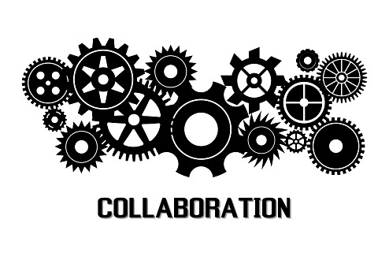
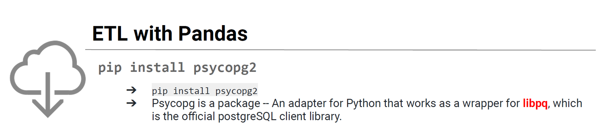
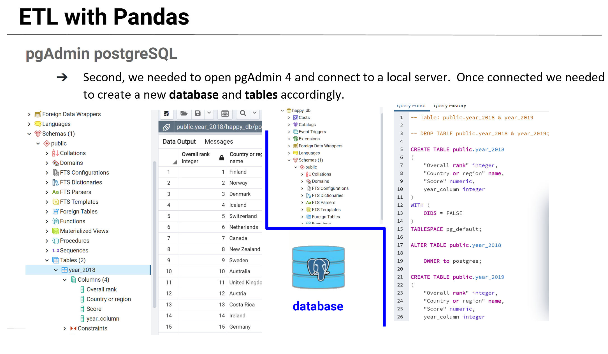
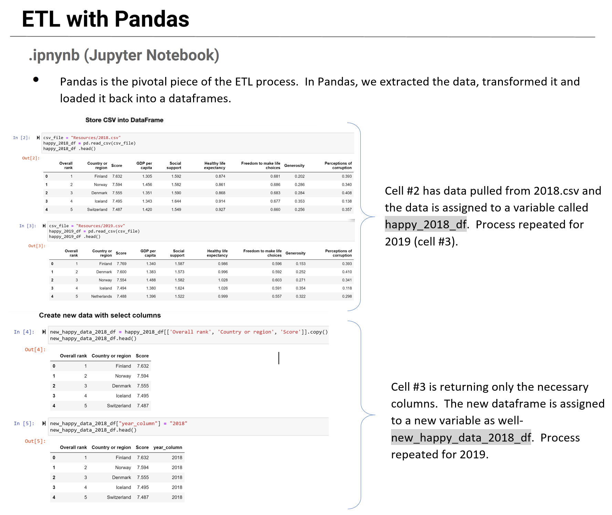
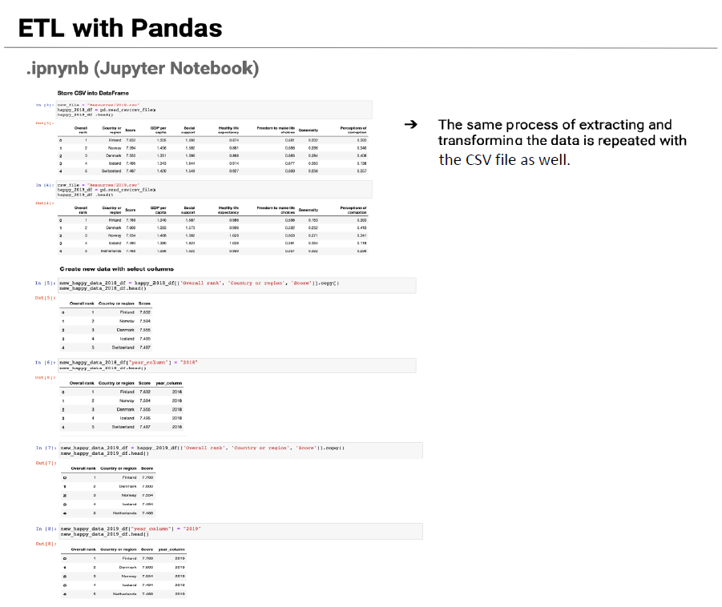
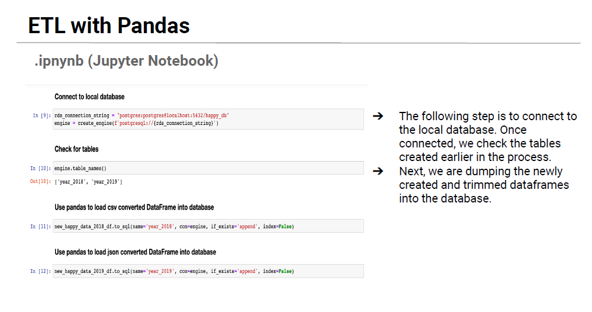
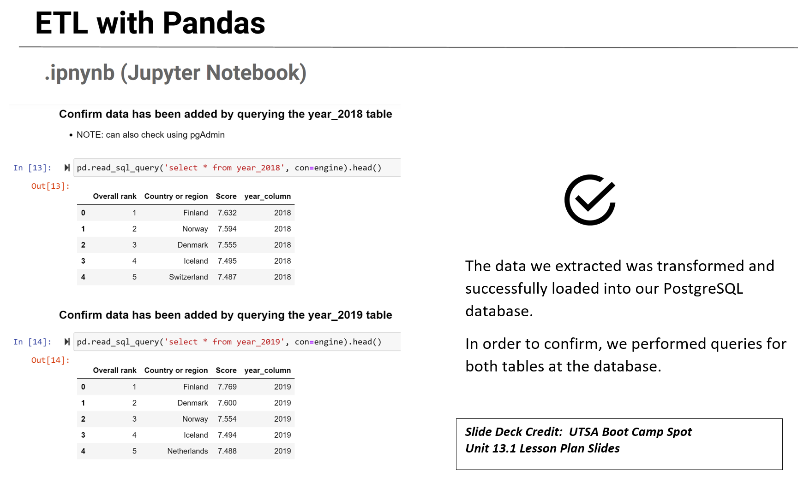

# ETL-Project

## Project Name:
> World Happiness Report

## Team Members: 
* [Dustin Osterman](https://github.com/dosterman09)
* [Mary Scruggs](https://github.com/mcasiano1)
* [Vanessa Vasquez](https://github.com/Vlvasquez23)

## Table of contents
* [Project Proposal](#Project-Proposal)
* [Getting Started](#Getting-Started)
* [Technologies](#technologies)
* [Sources](#sources)
* [Data Clean-Up](#data-clean-up)
* [ETL Visualization](#ETL-Visualization)
* [Code](#Code)
* [Status](#Status)
* [Acknowledgement](#Acknowledgement)
* [Inspiration](#inspiration)

# Project Proposal
Before you start writing any code, remember that you only have one week to complete this project. View this project as a typical assignment from work. Imagine a bunch of data came in and you and your team are tasked with migrating it to a production data base.

Take advantage of your Instructor and TA support during office hours and class project work time. They are a valuable resource and can help you stay on track.

## Finding Data

Your project must use 2 or more sources of data. We recommend the following sites to use as sources of data:

* [data.world](https://data.world/)

* [Kaggle](https://www.kaggle.com/)

You can also use APIs or data scraped from the web. However, get approval from your instructor first. Again, there is only a week to complete this!

## Data Cleanup & Analysis

Once you have identified your datasets, perform ETL on the data. Make sure to plan and document the following:

* The sources of data that you will extract from.

* The type of transformation needed for this data (cleaning, joining, filtering, aggregating, etc).

* The type of final production database to load the data into (relational or non-relational).

* The final tables or collections that will be used in the production database.

You will be required to submit a final technical report with the above information and steps required to reproduce your ETL process.

## Project Report

At the end of the week, your team will submit a Final Report that describes the following:

* **E**xtract: your original data sources and how the data was formatted (CSV, JSON, pgAdmin 4, etc).

* **T**ransform: what data cleaning or transformation was required.

* **L**oad: the final database, tables/collections, and why this was chosen.

Please upload the report to Github and submit a link to Bootcampspot.

- - -

### Copyright

© 2021 Trilogy Education Services, LLC, a 2U, Inc. brand. Confidential and Proprietary. All Rights Reserved.

- - - - - - - - - 

# Getting Started

## Technologies
* Jupyter Notebook
* PgAdmin
* GitHub

## Sources
[Kaggle](https://www.kaggle.com/)

* [Kaggle: World Happiness Report](https://www.kaggle.com/unsdsn/world-happiness/activity)
* [2018.csv](./Resources/2018.csv)
* [2019.csv](./Resources/2019.csv)

## Data Clean-Up
We performed our ETL data on the 2018 and 2019 csv file. We cleaned our data by using jupyter notebook to drop columns to create a new data set with select column of Overall rank, Country or region & score. We then merged our two data sets and added a “Year” column to differentiate which data was for 2018 and 2019. After connecting to our local postgres database we created our tables and columns into pgadmin.

After checking for tables we used pandas to load our new 2018 & 2019 csv/json converted DataFrame into the database. We then confirmed that the data has been added by querying the 2018 & 2019 table.

## ETL Visualization

## Code
* [Data_ETL_World_Happiness.ipynb](Data_ETL_World_Happiness.ipynb)
* [create_tables.sql](create_table.sql)

## Status
Project Complete

## Acknowledgement
* Jeff Anderson, Instructor, UTSA Bootcamp for guiding us though the project.
* [Kaggle: World Happiness Report](https://www.kaggle.com/unsdsn/world-happiness/activity)
* [README.md Template Inspiration ](https://github.com/ritaly/README-cheatsheet/edit/master/README.md) 

## Inspiration
Add here credits. Project inspired by..., based on...

